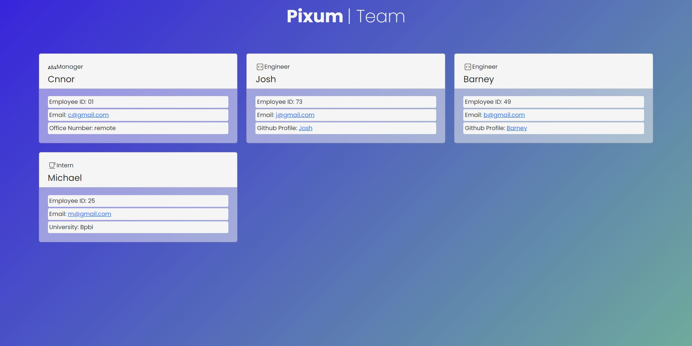

# Team Profile Generator

Use the command line to generate an html page to display your project and its team members!

## Important Info  
*The generated HTML file can be found in the dist/ folder. You can copy and paste this file into your projects website!*
*To see a video walk-through of someone using this repo to generate an HTML page, click the video-tutorial link.*
  
## Tutorial Video
[Video Tutorial]()
  
## Challenge Description | User Story
### **AS A manager**
I WANT to generate a webpage that displays my team's basic info  
SO THAT I have quick access to their emails and GitHub profiles  

### **Acceptance Criteria**

GIVEN a command-line application that accepts user input  
WHEN I am prompted for my team members and their information  
THEN an HTML file is generated that displays a nicely formatted team roster based on user input  
WHEN I click on an email address in the HTML  
THEN my default email program opens and populates the TO field of the email with the address  
WHEN I click on the GitHub username  
THEN that GitHub profile opens in a new tab  
WHEN I start the application  
THEN I am prompted to enter the team manager’s name, employee ID, email address, and office number  
WHEN I enter the team manager’s name, employee ID, email address, and office number  
THEN I am presented with a menu with the option to add an engineer or an intern or to finish building my team  
WHEN I select the engineer option  
THEN I am prompted to enter the engineer’s name, ID, email, and GitHub username, and I am taken back to the menu  
WHEN I select the intern option  
THEN I am prompted to enter the intern’s name, ID, email, and school, and I am taken back to the menu  
WHEN I decide to finish building my team  
THEN I exit the application, and the HTML is generated  
 
## Generated Team Profile Screenshot

